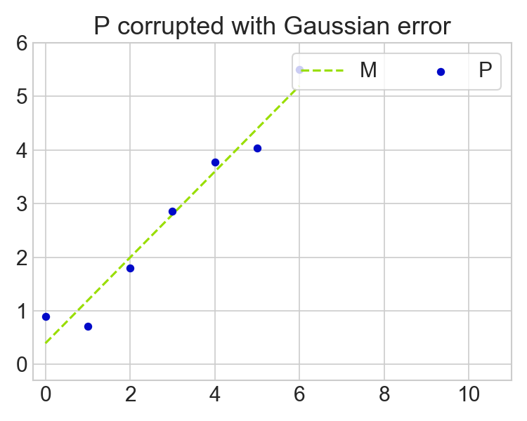
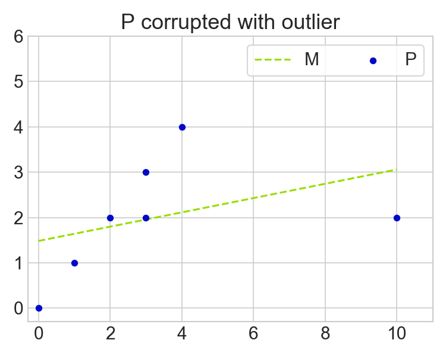
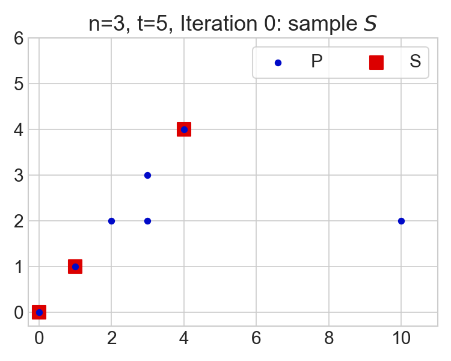
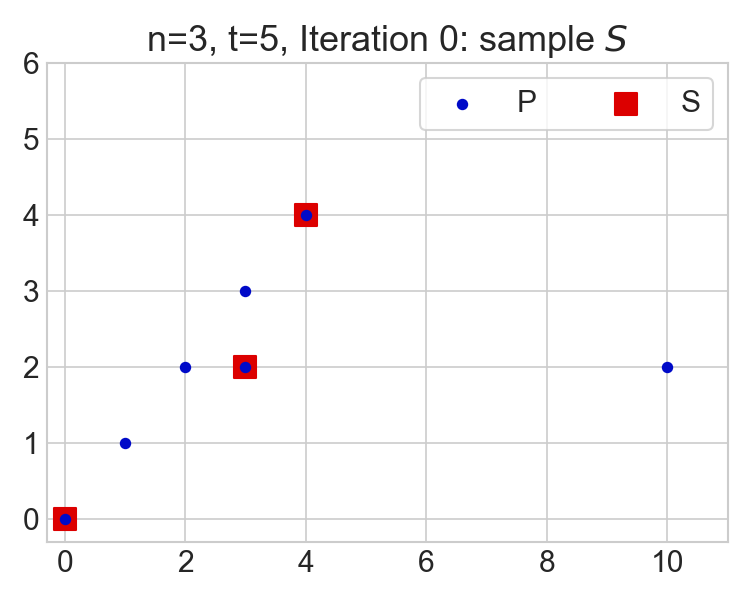
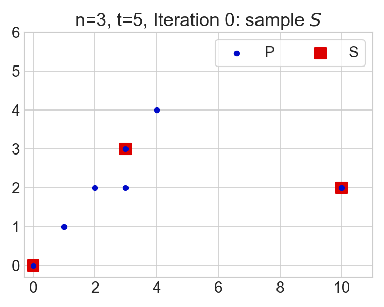
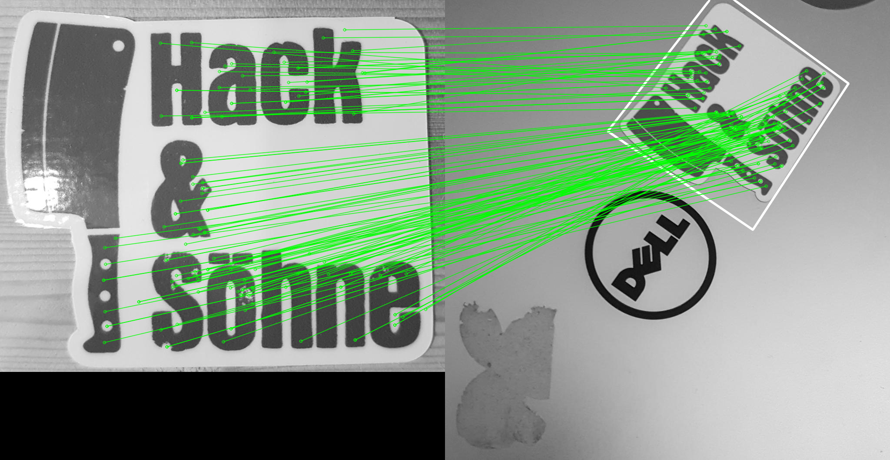
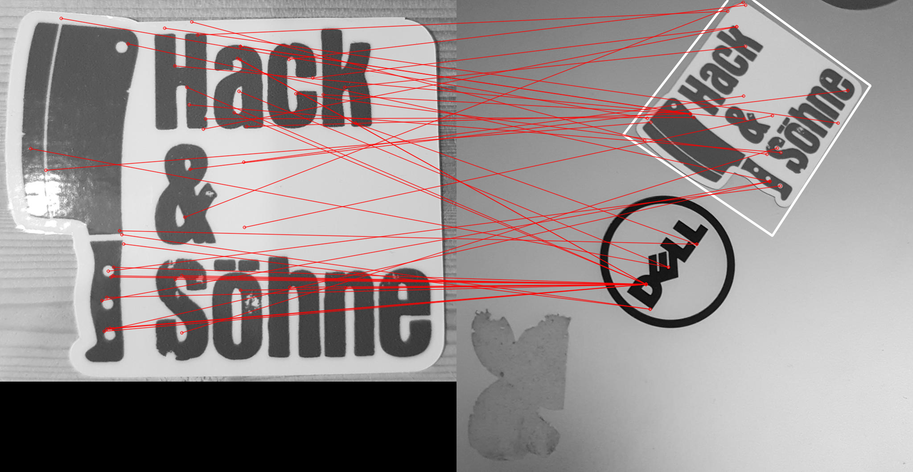

---
html:
  embed_local_images: false
  embed_svg: true
  offline: false
  toc: true

print_background: false

export_on_save:
  html: True
---

<center>
    <a style="font-weight:bold" href="https://therealsupermario.gitlab.io/zim_public/index">Back to overview</a>
</center>

# RANSAC - RANdom SAmple Consensus


## Example : The Failing of Least Squares

Let's say we want to fit a model $M$ to a set of data points $P$. 
Ideally, our model is able fit the data points exactly, assuming the error in the data is small.
To give an example, let's assume M is simply a linear model, or in other words a line, which can be described by two parameters.
We can then write down our model for each data point.
$$
y_i = a \cdot x_i + b,~ i = 1, \dots, |P|
\Leftrightarrow 
    \underbrace{
        \begin{bmatrix} y_1 \\ \vdots \\ y_{|P|} \end{bmatrix} 
    }_{Y}
=   \underbrace{
        \begin{bmatrix} x_1 & 1 \\ \vdots & \vdots \\ x_{|P|} & 1 \end{bmatrix}
    }_{X}
    \underbrace{
        \begin{bmatrix} a & b \end{bmatrix}
    }_{M}
$$

We now assume two cases, a Gaussian error and a non-Gaussian error which resembles more likely outlier cases.
To fit the model M, we simply use a least-squares solution for both cases.
$$
M = X^\dagger Y
$$

Two cases with fitted models are depicted in Fig. 1.

Clearly, the Gaussian error is easy to handle with (in fact, the least-squares solution is optimal for Gaussian errors).
But the second case completely biases the model estimate towards a bad solution. Can we maybe do better than that?


<figure class="half" align="center">
    <a href="01_Example/P_gaussian.png"></a>
    <a href="01_Example/P_outlier.png"></a>
    <figcaption>Fig 1: Data points $P$ corrupted with different errors and their model estimates $M$.</figcaption>
</figure>


------


# (Vanilla) Random Sample Consensus

Luckily, Fischler and Bolles [^1][^2] thought about this already in 1981 and invented an something called Random Sample Consensus (RANSAC).
On a high level, the idea is to use only a random subset of the data points $P$ to fit the model.
More precisely, they propose the following steps.

1. sample $n$ points (without replacement) from the entire point set $P$ and call the set $S$.
2. estimate $M$ based on $S$, for instance using least squares.
3. calculate consensus set $S^{\ast}$ by taking all points within $P$ which are within a certain tolerance $\epsilon$ of $M$.
4. evaluate if the fit is good enough using the size of $S^{\ast}$.
    1. if $S^{\ast} > t$, exit and return $S^{\ast}$ to calculate $M^{\ast}$.
    2. if $S^{\ast} < t$, and max number of trials k is not exceeded, start over, meaning that we again sample **randomly** from P.
5. if number of trials $k$ is exceeded, return largest consensus set found.

In code, this looks like this.

```python
def iterate_ransac(P, n, t, e_tol, k = 10):
    """vanilla ransac, i.e. we sample randomly a set of n points from P"""
    terminate = False
    num_steps = 0
    best_S = None
    S = sample_S(P, n)
    while not terminate and num_steps < k:
        print("step ", num_steps)
        M = fit_model(S)
        S_prime = get_consensus(M, P, e_tol)
        
        print("|S*| = {}".format(len(S_prime)))
        if len(S_prime) >= t:
            print("terminating")
            best_S = S_prime
            terminate = True
            yield S, S_prime
            continue
        else:
            S_old = S.copy() # for visualization
            S = sample_S(P, n)
            if best_S is None:
                best_S = S_prime
            else:
                if len(S_prime) > len(best_S):
                    best_S = S_prime
            num_steps += 1
        yield S_old, S_prime
    return
```

Note that in practice, we can parallelize the process instead of iterating, because there is no update to the data $P$.


<figure class="half", align="center">
    <a href="02_Vanilla_RANSAC/seed_40_n2_t5/animation.gif"></a>
    <a href="02_Vanilla_RANSAC/seed_42_n2_t5/animation.gif"></a>
    <figcaption>Fig 2: Vanilla RANSAC iteration.</figcaption>
</figure>


## The effect of n and t

It has to be noted that $n$ and $t$ still need to be chosen and maybe engineered to fit the problem.
In general, $n$ should be larger than the model parameters to correct for some errors but it should still be small so that it does not bias the estimate too much.

If $t$ is too small, one risks that a wrong model reaches a consensus with the data. 
I highlighted this effect below, by taking the same data and random initialization for $t=4$ and $t=5$.
Observe that for $t=4$, a wrong solution is returned, whereas the solution is rejected for $t=5$.
This could be solved by simply testing many model fits ($k$) in parallel and then choosing the one with the largest consensus instead of iterating and terminating.
However, I think it is nice to highlight this detail as a possible pitfall.


<figure class="half", align="center">
    <a href="02_Vanilla_RANSAC/seed_41/animation.gif"></a>
    <a href="02_Vanilla_RANSAC/seed_41_n2_t5/animation.gif"></a>
    <figcaption>Fig 3: The expected size of the consensus set t influences the model selection. Left: with t=4, a bad solution get accepted and the algorithm terminates. With t=5, the solution from left is rejected, thus the iteration starts over. It finds the right solution in the next iteration. </figcaption>
</figure>

------

## Application: Find homography between two images

Where do we need RANSAC in practice? We can use it to find the warping between two corresponding images or objects and their placement within the image.

Look at the example in Fig. 4 where I am using a cool logo as a template and want to find it in the other image, which we call the scene.

<figure class="half", align="center">
    <a href="03_Homography_Estimation/template.jpg"></a>
    <a href="03_Homography_Estimation/scene.jpg"></a>
    <figcaption>Fig 4: We want to find the left template in the right scene.</figcaption>
</figure>


We can assume that the logo is planar and also planar on the surface in the scene.
Then the logo in the scene and the logo in our template are related by a homography.
The homography is our model $M$ and we assume that it acts on all points equally, thus we assume
that we can find a matrix $H$ that relates both sets of points [^3].

$$
    s_i \begin{bmatrix}
        \tilde{x}_i
    \\
        \tilde{y}_i
    \\
        1
    \end{bmatrix}
    = 
    H
    \begin{bmatrix}
        x_i
    \\
        y_i
    \\
        1
    \end{bmatrix}
$$


To find the corresponding points on the template and in the scene, we use SIFT feature matching. I am going to explain this in a different blog post. For now we just assume that it gives exactly the same kind of problem as explained earlier. To find the homography matrix $H$, again use a least-squares fit on a subset of the point correspondences and apply the RANSAC paradigm. 

In Fig. 5, we can see the correspondences and the rejected outliers. Note that the actual openCV code just uses a nice `H, mask = cv2.findHomography(x_template, x_scene, cv2.RANSAC, tolerance)` function call, so no need to manually implement RANSAC.
The returned `H` is the homography matrix and `mask` is the boolean mask indicating the inlier points.
Finally note that `H` is calculated so that $h_{33} = 1$, thus it determined only up to a certain scale.


<figure class="half" align="center">
    <a href="03_Homography_Estimation/inlier_matches.png"></a>
    <a href="03_Homography_Estimation/outlier_matches.png"></a>
    <figcaption>Fig 5: Matched interest points (green) and rejected outliers (red).</figcaption>
</figure>


## Remarks and Pitfalls

1. Since OpenCV release 3.4.2, SIFT is not part of the package anymore [^4]. To fix this, one has to `pip install opencv-contrib-python==xxx` where `xxx` is your version. You most likely do NOT have to manually compile your own OpenCV version.


<center>
    <a style="font-weight:bold" href="https://therealsupermario.gitlab.io/zim_public/index">Back to overview</a>
</center>


[^1]: [Fischler's homepage](http://homepages.inf.ed.ac.uk/rbf/CVonline/LOCAL_COPIES/FISHER/RANSAC/)
[^2]: [M. A. Fischler, R. C. Bolles. Random Sample Consensus: A Paradigm for Model Fitting with Applications to Image Analysis and Automated Cartography. Comm. of the ACM, Vol 24, pp 381-395, 1981.](https://dl.acm.org/doi/10.1145/358669.358692)
[^3]: [OpenCV Docs - Homography](https://docs.opencv.org/3.4/d1/de0/tutorial_py_feature_homography.html)
[^4]: [Where did SIFT go](https://www.pyimagesearch.com/2015/07/16/where-did-sift-and-surf-go-in-opencv-3/)


